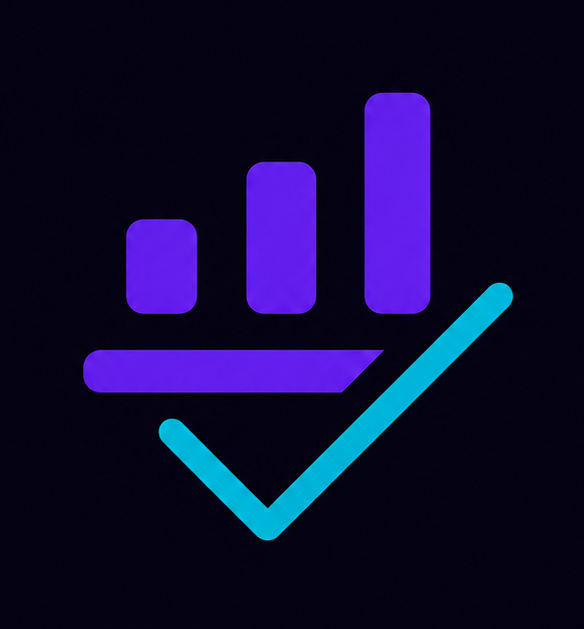

<div align="center">



# VERDICT

### Stop deciding on vibes. Get a verdict.

[](https://anakin-verdict.vercel.app)
[](https://anakin.io)
[](https://ai.google.dev)
[](https://anakin.io)

**Built solo in 48 hours for the Anakin Build-a-thon 2026**

</div>

---

## The Problem

Every big decision you make — job offers, gadgets, investments, college — you're doing it on vibes.

Google gives you ads. Reddit threads are 3 years old. ChatGPT makes things up. Friends guess.

**Nobody gives you a real answer backed by data pulled right now.**

## The Solution

VERDICT takes any life dilemma in plain English and returns a structured, evidence-backed verdict in under 15 seconds — powered entirely by live web data scraped in real time via **Anakin Wire**.

```
"Should I join a 6 LPA startup or 9 LPA service company fresh out of college?"
                                    ↓
        8 sources scraped in parallel via Anakin Wire
        Glassdoor · Blind · Reddit · LinkedIn · AmbitionBox · News
                                    ↓
              Conflicts detected, confidence scored
                                    ↓
         🎯 VERDICT: Take the startup. Negotiate a joining bonus.
                      Confidence: 81% · 6 sources · 2.1s
```

**Wire is not a feature here. Wire IS the product.** Without live scraping, this is just another chatbot guessing.

---

## Demo

> **[▶ Try it live → verdict.vercel.app](https://anakin-verdict.vercel.app)**

| Query | Decision Type | Sources Fired |
|---|---|---|
| "Should I buy boAt Airdopes 141 now?" | PURCHASE | Amazon · Flipkart · Reddit · YouTube |
| "Is Scaler worth ₹1.5L for a fresher?" | EDUCATION | Shiksha · Reddit · LinkedIn alumni |
| "Should I invest in Nifty50 right now?" | FINANCE | Screener · Moneycontrol · Reddit · News |
| "Startup 7 LPA vs Infosys 10 LPA?" | CAREER | Glassdoor · Blind · LinkedIn · AmbitionBox |

---

## Features

### 🔮 Core Verdict Engine
Full E2E streaming pipeline. Query → classify → scrape → detect conflicts → synthesise → stream. Everything live, nothing mocked in production.

### ⚡ Real-Time SSE Streaming
Results stream to the UI the moment each Wire source resolves — users watch the intelligence being built live. No waiting for all sources before showing anything.

### 🌊 Wave 1 + Wave 2 Architecture
Wave 1 fires all sources in parallel. Wave 2 triggers conditional deep scans based on what Wave 1 finds — Crunchbase if a startup is detected, AmbitionBox if salary data conflicts, price history if a drop is detected.

### ⚠️ Cross-Source Conflict Detection
When sources disagree (Glassdoor says 4★, Blind says toxic culture), VERDICT surfaces the conflict explicitly, explains why it exists, and penalises the confidence score mathematically.

### 📊 Live Confidence System
Confidence starts at 50% when the query submits. Ticks up or down in real time as each source resolves. Animated radial gauge with delta indicators (`+13`, `-8`) on every tick.

### 🎯 Adaptive Decision Lenses
Five advisor modes that change how Gemini weights the evidence:

| Mode | Behaviour |
|---|---|
| Conservative | Risk-averse, favours stability |
| Balanced | Standard 50/50 risk/reward (default) |
| Aggressive | Maximises growth and upside |
| Long-Term | 5–10 year compound outcome focus |
| Risk-Averse | Strongly penalises any uncertainty |

### 🔄 "This Verdict Changes If"
Every verdict includes the specific conditions that would flip the recommendation — with influence weights and severity levels. Built entirely from Gemini reasoning over live Wire data.

### 💬 Conversational Follow-Up Sandbox
Ask follow-up questions after a verdict. The system preserves the full evidence graph — no re-scraping — and streams context-aware responses instantly.

### ⚡ Explainability Matrix
Full decision trace: processing tree, weighted scoring meters, source authority ratings, and a contradiction penalty audit showing every confidence point deduction.

### 📤 Shareable Verdict Cards
Export as a 1200×630 PNG card rendered locally via HTML5 Canvas. Share a `?q=...` URL that auto-triggers the same query for anyone who opens it.

### ⚖️ Judge Demo Mode
One-click activation that streams a guaranteed-stable simulation for flawless presentations, even if APIs fail or latency spikes.

### 📜 Personal Intelligence Archive
Persistent drawer that auto-saves every verdict. Full-text search, category filtering, bookmarks, and a comparison sandbox for side-by-side verdict analysis.

### 🗄️ SQLite Caching
Repeated identical queries are served from cache instantly, tagged with `⚡ Cache Repository` in the UI.

---

## Architecture

```
User Query
      │
      ▼
┌─────────────────────────────────────────────┐
│              VERDICT FRONTEND               │
│  Next.js 15 · React 19 · Tailwind CSS v4    │
│  SSE Client · TypeScript Strict Mode        │
└──────────────────┬──────────────────────────┘
                   │  POST /api/verdict
                   ▼
┌─────────────────────────────────────────────┐
│             EXPRESS BACKEND                 │
│  Node.js · TypeScript · SSE Event Emitter   │
│  SQLite Cache · Source Reliability Tracker  │
└──────┬──────────────┬────────────┬──────────┘
       ▼              ▼            ▼
  Anakin Wire     Gemini API    SQLite DB
 (Live Scraping)  (Synthesis)   (Cache)
```

### Pipeline Steps

```
Step 1  Intent Classification    Gemini classifies query into
                                 CAREER / PURCHASE / FINANCE / EDUCATION
                                 Extracts named entities for targeted scraping

Step 2  Wave 1 Fan-Out           6–8 Wire actions fire in parallel
                                 Promise.allSettled() — no source blocks another

Step 3  Wave 2 Conditional       Follow-up scrapes triggered by Wave 1 findings
                                 Crunchbase · AmbitionBox · Price history

Step 4  Conflict Detection       Cross-source contradiction engine
                                 Severity levels · Confidence penalties

Step 5  Gemini Synthesis         All evidence → structured verdict JSON
                                 Adapts reasoning to selected Decision Lens

Step 6  SSE Stream               Each stage emits live to frontend
                                 classifying → wave1 → conflicts → verdict_ready
```

---

## Tech Stack

| Layer | Technology |
|---|---|
| Frontend | Next.js 15 (App Router) · React 19 · TypeScript |
| Styling | Tailwind CSS v4 · Syne · DM Sans · JetBrains Mono |
| Real-time | Server-Sent Events (SSE) via HTML5 EventSource |
| Backend | Node.js · Express.js (ESM modules) |
| Database | SQLite 3 via better-sqlite3 |
| Scraping | **Anakin Wire / Holocron API** |
| AI | Google Gemini API (gemini-1.5-flash) |
| Monorepo | npm Workspaces |
| Hosting | Vercel (frontend) · Railway (backend) |

---

## Getting Started

### Prerequisites

- Node.js 18+
- An [Anakin Wire API key](https://anakin.io/dashboard)
- A [Google Gemini API key](https://aistudio.google.com/apikey)

### Installation

```bash
# Clone the repo
git clone https://github.com/YOUR_USERNAME/verdict.git
cd verdict

# Install all dependencies (root + frontend + backend)
npm install
```

### Environment Setup

Create `backend/.env`:

```env
ANAKIN_API_KEY=your_anakin_wire_api_key
GEMINI_API_KEY=your_gemini_api_key
NODE_ENV=development
PORT=5000

# Set to false during development to use mock data
# Set to true for production / demo
USE_REAL_WIRE=true
```

### Run Locally

```bash
# Start both frontend and backend concurrently
npm run dev

# Frontend → http://localhost:3000
# Backend  → http://localhost:5000
# Health   → http://localhost:5000/health
```

---

## Deployment

### Backend → Railway

1. Connect your GitHub repo at [railway.app](https://railway.app)
2. Set root directory to `/backend`
3. Add environment variables from `backend/.env`
4. Railway auto-deploys on every push

### Frontend → Vercel

1. Connect your GitHub repo at [vercel.com](https://vercel.com)
2. Set root directory to `/frontend`
3. Add environment variable:
   ```
   NEXT_PUBLIC_BACKEND_URL=https://your-backend.up.railway.app
   ```
4. Vercel auto-deploys on every push

---

## Project Structure

```
verdict/
├── package.json                    ← Root monorepo
│
├── frontend/
│   ├── app/
│   │   ├── layout.tsx              ← HTML shell, fonts, metadata
│   │   ├── page.tsx                ← Main app orchestrator
│   │   └── globals.css             ← Design system, animations
│   ├── components/
│   │   ├── VerdictInput.tsx        ← Hero search + Decision Lens selector
│   │   ├── VerdictDisplay.tsx      ← Full results dashboard
│   │   ├── SkeletonLoader.tsx      ← Live execution timeline HUD
│   │   ├── IntelligenceArchive.tsx ← History drawer + comparison
│   │   └── GlowingGlow.tsx         ← Ambient background orbs
│   ├── hooks/
│   │   └── useVerdictSSE.ts        ← SSE connection + state machine
│   └── types/
│       └── index.ts                ← TypeScript interfaces
│
└── backend/
    ├── server.ts                   ← Entry point, CORS, middleware
    ├── routes/
    │   └── verdict.ts              ← SSE endpoint + demo simulator
    ├── services/
    │   └── gemini.ts               ← Gemini client + fallbacks
    ├── orchestrators/              ← Wave 1 & Wave 2 coordinator
    ├── classifiers/                ← Intent detection
    ├── wire/                       ← Anakin Wire HTTP client
    ├── prompts/                    ← Gemini system prompts
    └── db/                         ← SQLite schema + connection
```

---

## Wire Integration

VERDICT uses Anakin Wire as its **sole data layer**. Every claim in every verdict comes from a live Wire scrape — not training data, not cached databases, not hallucination.

### Sources by Decision Type

| Decision | Wire Sources |
|---|---|
| CAREER | Glassdoor · Blind · LinkedIn · Reddit · AmbitionBox · News |
| PURCHASE | Amazon · Flipkart · Reddit · YouTube |
| FINANCE | Screener · Moneycontrol · Reddit · Economic Times |
| EDUCATION | Shiksha · Reddit · LinkedIn alumni · Placement data |

### Why Wire Makes This Possible

Every one of these sites has no public API, actively blocks scrapers, requires JavaScript rendering, and needs authenticated sessions. Wire handles all of it — anti-detection, proxy routing, JS execution, login persistence — in a single API call.

```javascript
// Wave 1 — all sources fire simultaneously
const wave1 = await Promise.allSettled([
  wire.action('glassdoor.company_reviews', { company }),
  wire.action('reddit.search', { query, subreddits }),
  wire.action('linkedin.career_outcomes', { company }),
  wire.action('blind.company_reviews', { company }),
  wire.action('news.recent', { query, days: 30 }),
]);

// Wave 2 — conditional on Wave 1 findings
if (isStartup && fundingUnknown) {
  const funding = await wire.action('crunchbase.company', { name });
}
```

---

## Judging Criteria

| Criteria | Weight | How VERDICT delivers |
|---|---|---|
| Idea | 40% | Universal pain felt daily by every person making real-life decisions. Never built this way. Decision layer on top of research. |
| Execution | 30% | Wire as true backbone. Dynamic source routing. SSE streaming. Conflict detection. Wave 2 conditional fan-out. Built solo in 48hrs. |
| Real-world Impact | 30% | Affects college choices, job offers, investments — decisions with real financial and life consequences. Immediate day-one utility. |

---

## Built By

**Piyush Amrutkar** — Solo submission for Anakin Build-a-thon 2026

---

<div align="center">

**POWERED BY ANAKIN WIRE API · GOOGLE GEMINI · REAL-TIME DECISION INTELLIGENCE**

</div>
